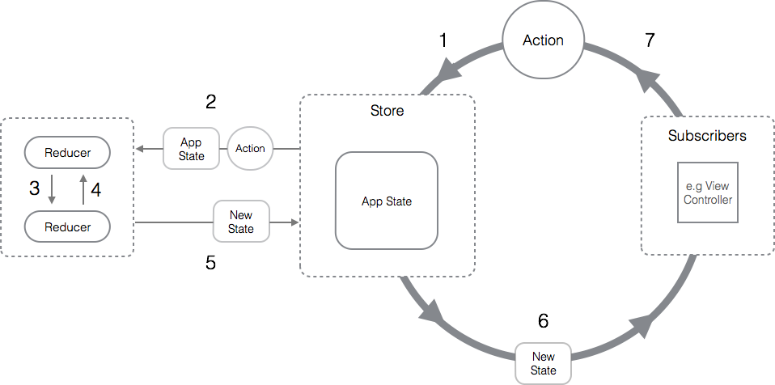

# Redux Intro

Redux is an open-source JavaScript library for managing and centralizing application state.

## REDUX CORE CONCEPTS:




## BASIC REDUX APP

1. CREATE STORE

```javaScript
import { configureStore } from "@reduxjs/toolkit";

const store = configureStore({
  reducer: {},
});

export default store;
```

2. CONNECT STORE WITH APP

```javaScript
import React from "react";
import ReactDOM from "react-dom/client";
import { Provider } from "react-redux";
import App from "./App.jsx";
import "./index.css";
import store from "./redux/store.js";

ReactDOM.createRoot(document.getElementById("root")).render(
  <React.StrictMode>
    <Provider store={store}>
      <App />
    </Provider>
  </React.StrictMode>
);
```

3. CREATE SLICE

```javaScript
import { createSlice } from "@reduxjs/toolkit";

const initialState = {
  count: 0,
};

const counterSlice = createSlice({
  name: "counter",
  initialState,
  reducers: { },
});

export default counterSlice.reducer;
```

4. CONNECT SLICE WITH STORE

```javascript
import { configureStore } from "@reduxjs/toolkit";
import counterReducer from "./features/counter/counterSlice";

const store = configureStore({
  reducer: {
    counter: counterReducer,
  },
});

export default store;
```

5. WRITE BUSINESS LOGIC IN REDUCER

```javascript
import { createSlice } from "@reduxjs/toolkit";

const initialState = {
  count: 0,
};

const counterSlice = createSlice({
  name: "counter",
  initialState,
  reducers: {
    increment: (state) => {
      state.count = state.count + 1;
    },
    decrement: (state) => {
      state.count = state.count - 1;
    },
    incrementByValue: (state, actions) => {
      state.count = state.count + actions.payload;
    },
  },
});

export const { increment, decrement, incrementByValue } = counterSlice.actions;

export default counterSlice.reducer;
```

6. CONSUME STATE

```javascript
import { useSelector } from "react-redux";

const ReduxCounter = () => {
  const { count } = useSelector((state) => state.counter);

  return (
    <div className="w-[300px] h-[220px] border-2 border-green-600 rounded-xl p-5 shadow-xl font-medium ">
      <h1 className="text-center text-xl uppercase">Redux Counter</h1>
      <div className="flex items-center justify-center mt-10 gap-5">
        <button className="btn">Decrease</button>
        <div className="text-3xl">{count}</div>
        <button className="btn">Increase</button>
      </div>
      <button className="btn w-full mt-5">Increase 5</button>
    </div>
  );
};

export default ReduxCounter;
```

7. ACTION DISPATCH

```javascript
import { useDispatch, useSelector } from "react-redux";
import {
  decrement,
  increment,
  incrementByValue,
} from "../redux/features/counter/counterSlice";

const ReduxCounter = () => {
  const { count } = useSelector((state) => state.counter);
  const dispatch = useDispatch();

  return (
    <div className="w-[300px] h-[220px] border-2 border-green-600 rounded-xl p-5 shadow-xl font-medium ">
      <h1 className="text-center text-xl uppercase">Redux Counter</h1>
      <div className="flex items-center justify-center mt-10 gap-5">
        <button className="btn" onClick={() => dispatch(decrement())}>
          Decrease
        </button>
        <div className="text-3xl">{count}</div>
        <button className="btn" onClick={() => dispatch(increment())}>
          Increase
        </button>
      </div>
      <button
        className="btn w-full mt-5"
        onClick={() => dispatch(incrementByValue(5))}
      >
        Increase 5
      </button>
    </div>
  );
};

export default ReduxCounter;
```

## Middleware

### Create Middleware

```javascript
const customLogger = (store) => (next) => (action) => {
  const previousState = store.getState();
  console.log("previousState :", previousState);
  console.log("actions :", action);
  next(action);
  const newState = store.getState();
  console.log("newState :", newState);
};

export default customLogger;
```

### Use Middleware

```javaScript
import { configureStore } from "@reduxjs/toolkit";
import counterReducer from "./features/counter/counterSlice";
import customLogger from "./middlewares/customLogger";

const store = configureStore({
  reducer: {
    counter: counterReducer,
  },
  middleware: (getDefaultMiddleware) =>
    getDefaultMiddleware().concat(customLogger),
});

export default store;

```
